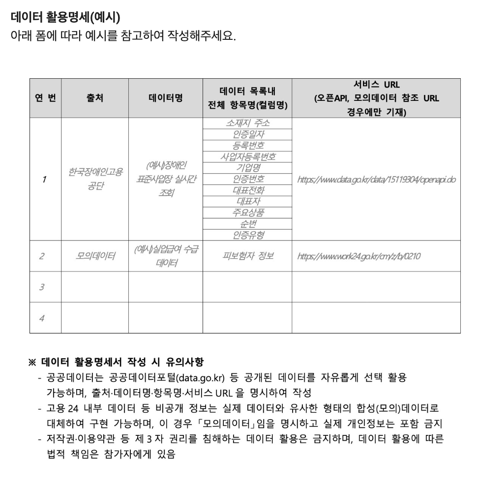

# 고용24 해커톤 참가신청 — 기본정보 및 제출자료

대표자가 아래 내용을 확정한 뒤 접수 폼에 항목별로 옮겨 적습니다. `[입력]`은 실제 정보로 바꾸세요. 팀 참가 시 대표자를 포함한 참여자 전원을 기재합니다.

## 팀명 (필수)

[입력: 팀명 — 서비스명 ‘이음’과 별도로 팀에서 확정]

개인 참가자는 `개인`으로 입력합니다.

## 아이디어명 (필수)

이음(Ieum) — AI 기반 고용 혜택 탐색 및 신청서류 작성 에이전트

## 아이디어소개 (필수, 500자 이내)

이음(Ieum)은 국민과 사업주가 정보 부족이나 복잡한 신청 절차로 놓치는 고용 혜택을 찾아 신청 준비까지 돕는 AI 에이전트입니다. 신규 채용, 이직, 육아휴직 등 상황 변화와 고용 이력을 바탕으로 관련 지원금·장려금·수당을 탐색하고, 자격 요건과 필요한 서류를 안내합니다. 생성형 AI가 신청서 초안을 작성해 사용자가 확인·수정한 뒤 제출을 준비할 수 있도록 지원합니다. MVP는 사업주와 개인 근로자 각 1개 시나리오를 구현하며, 공개 공공데이터를 활용하고 비공개 정보는 합성데이터로 대체합니다. 혜택 탐색부터 서류 작성까지 연결해 신청 부담을 줄이는 것이 목표입니다.

## 대표자 성명 (필수)

서호균

## 대표자 생년월일 (필수)

[입력: YYYY-MM-DD]

접수 폼의 날짜 입력란에서 해당 날짜를 선택합니다.

## 대표자 소속 (필수)

신한대학교

소속이 없으면 `없음`으로 입력합니다.

## 대표자 휴대전화 (필수)

[입력: 010-XXXX-XXXX]

## 대표자 이메일 (필수)

seohogyun3@naver.com

## 팀 구성 인원 (필수)

4인

대표자를 포함한 전체 인원으로, 접수 폼에서 해당 옵션 하나를 선택합니다.

## 팀원 2 정보 (팀 참가 시 필수)

최우진 / 포항공과대학교 / woo041213@postech.ac.kr

개인 참가자는 비워 둡니다.

## 팀원 3 정보 (3~4인 팀만 작성)

김명진 / 소속: 서경대학교 / 이메일: kmjin041010@gmail.com

## 팀원 4 정보 (4인 팀만 작성)

장준혁 / 대진대학교 / 20230567@daejin.ac.kr

## 제출 전 확인

- [ ] 팀명과 아이디어명을 팀에서 확정했습니다.
- [ ] 아이디어소개가 500자 이내인지 확인했습니다.
- [ ] 대표자와 참여 팀원 전원의 정보를 정확히 입력했습니다.
- [ ] 팀 구성 인원과 실제 기재한 참여자 수가 일치합니다.
- [ ] 대표자 연락처와 안내 수신 이메일을 확인했습니다.

기획안 원문: [아이디어_이음.md](아이디어_이음.md)

## 4. 제출자료

### 아이디어 기획안 1부 (필수)

- 형식: **PDF**
- 분량: **10페이지 이내**
- 자유양식으로 작성하되 아래 필수 목차를 모두 포함합니다.
- 이미지 파일은 문서 내에 반드시 포함합니다.
- 제시한 목차 외 추가 내용은 별도 제목을 붙여 작성합니다.

### 기획안 필수 목차 및 작성 사항

| 목차 | 작성해야 하는 내용 |
| --- | --- |
| 아이디어명 | 아이디어 특징이 드러나도록 간략히 작성 |
| 아이디어 정의 및 대상 | 제안 내용, 대상(구직자·기업·취약계층 등), 구체적 이용 상황, 고용24 기존 서비스에 없거나 개선이 필요한 이유 |
| AI·데이터 활용 계획 | 적용 AI 기술과 적용 논리, AI가 반드시 필요한 이유, 활용 데이터와 확보 방안, 데이터 활용명세서 첨부 |
| 실행계획 | 개발 기간 내 구현 가능한 MVP 범위, 서비스 흐름, 주요 화면 구성, 팀 구성과 역할 분담 |
| 독창성·차별성 | 현행 고용24 및 민간 서비스 대비 차별성, 아이디어의 참신성 |
| 기대효과 | As-Is/To-Be 기준 국민 체감 효과, 고용서비스 정책 목표와의 부합성 |

### 필수 목차 작성 확인 (접수 폼 필수 응답)

**아이디어명 / 아이디어 정의 및 대상 / AI·데이터 활용 계획 / 실행계획 / 독창성·차별성 / 기대효과를 모두 기입했는지 확인합니다.**

- [ ] 아이디어명
- [ ] 아이디어 정의 및 대상
- [ ] AI·데이터 활용 계획 및 데이터 활용명세서
- [ ] 실행계획
- [ ] 독창성·차별성
- [ ] 기대효과

모두 확인한 뒤 접수 폼에서 **`모두 기입하였습니다.`**를 선택합니다. 미기입에 따른 불이익은 참여자에게 있습니다.

### 아이디어 기획서 제출 (필수 업로드)

[입력: 최종 PDF 파일명 / 보관 위치]

- 지원되는 파일 **1개**를 업로드합니다. 최대 크기는 **10 GB**입니다.
- 최종 PDF를 열어 페이지 수, 필수 목차, 이미지 포함 여부를 확인합니다.
- 업로드가 정상적으로 진행되지 않으면 본인 Google 계정의 Google Drive 저장용량을 확인·정리한 뒤 다시 제출합니다.

### 데이터 활용명세 예시 이미지

접수 폼에서 제공한 예시입니다. 아래 이미지의 데이터와 URL은 **작성 형식 참고용**이며, 이음 서비스의 확정 활용 데이터가 아닙니다.



### 데이터 활용명세 입력 (필수)

접수 항목: **활용 데이터 제공기관(출처) / 활용 데이터명 및 출처 URL / 데이터 목록 내 전체 항목명 / 활용 데이터 API 정보**

활용 데이터가 여러 곳이면 모두 기입합니다. 아래 표에 실제 활용할 데이터를 정리한 뒤, 이어지는 텍스트 양식으로 접수 폼에 옮겨 적습니다.

| 연번 | 출처(제공기관 또는 모의데이터) | 데이터명 | 데이터 목록 내 전체 항목명(컬럼명) | 서비스 URL(오픈API·모의데이터 참조 URL인 경우 기재) |
| --- | --- | --- | --- | --- |
| 1 | [입력] | [입력] | [입력: 전체 항목명] | [입력] |
| 2 | [입력] | [입력] | [입력: 전체 항목명] | [입력] |
| 3 | [입력] | [입력] | [입력: 전체 항목명] | [입력] |
| 4 | [입력] | [입력] | [입력: 전체 항목명] | [입력] |

필요한 만큼 행을 추가합니다. 실제 데이터 목록·API 명세를 확인해 작성하고, 모의데이터는 자체 설계한 전체 컬럼을 기재합니다.

**접수 폼 복사용 양식 — 데이터마다 반복 작성**

```text
1. 활용 데이터 제공기관(출처): [입력 / 모의데이터인 경우 명시]
활용 데이터명: [입력]
출처 URL: [입력]
데이터 목록 내 전체 항목명(컬럼명): [전체 항목 입력]
활용 데이터 API 정보: [API명, 요청 주소, 요청·응답 형식, 인증 및 확보 방법 / API를 사용하지 않으면 해당 없음]
서비스 URL(오픈API·모의데이터 참조 URL): [해당하는 경우 입력]
```

### 데이터 활용명세 작성 시 유의사항

- 공공데이터포털(data.go.kr) 등 공개된 데이터를 선택하여 활용할 수 있으며, 출처·데이터명·항목명·서비스 URL을 명시합니다.
- 고용24 내부 데이터 등 비공개 정보는 실제 데이터와 유사한 형태의 합성(모의)데이터로 대체할 수 있습니다. 이 경우 **모의데이터임을 명시**하고 **실제 개인정보는 포함하지 않습니다.**
- 저작권·이용약관 등 제3자 권리를 침해하는 데이터 활용은 금지되며, 데이터 활용에 따른 법적 책임은 참가자에게 있습니다.

### 제출자료 최종 확인

- [ ] 필수 목차 6개를 모두 작성했습니다.
- [ ] 데이터 활용명세서를 기획안에 첨부했습니다.
- [ ] PDF가 10페이지 이내이며 이미지가 문서 안에 포함되어 있습니다.
- [ ] 사용 예정 데이터 전체의 출처·URL·전체 항목명·API 정보를 입력했습니다.
- [ ] 모의데이터 여부와 실제 개인정보 미포함을 확인했습니다.
- [ ] 최종 PDF 파일 1개를 업로드하고 업로드 완료 여부를 확인했습니다.
